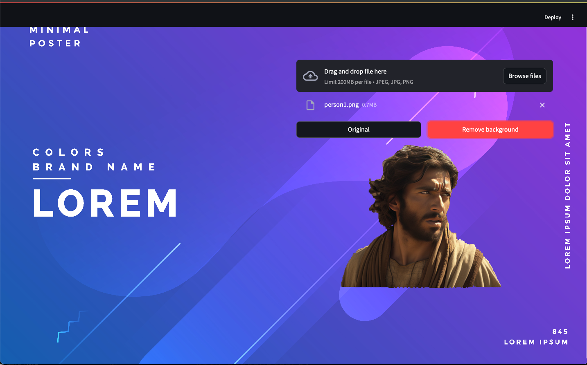

## 🎬 tutorials

<strong>Image Background Remove</strong>

<strong>Created: 28 May 2025</strong>

  
 streamlit, streamlit_dimensions 
 streamlit_image_coordinates doesn't work properly, so it's handled in the default way. Subsequent modifications are required.

 

<strong>Text Detection Tutorial</strong> 

<strong>Created: 28 May 2025</strong>

 
 pytesseract,  
 easyocr,  
 aws textract 

 
 
 

<strong>OpenCV Tutorial</strong> 

<strong>Created: 28 May 2025</strong>

 
 image, video, webcam, resizing, crop, color spaces, blurring, threshold, edge detection, drawing, contours

 